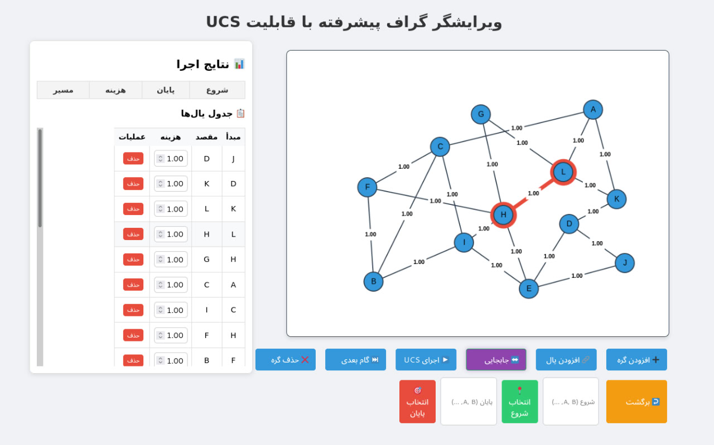

# Graph Editor with UCS Algorithm

A web-based interactive graph editor for visualizing the Uniform Cost Search (UCS) algorithm. Create nodes, edges, and simulate step-by-step pathfinding with cost analysis.

 <!-- Add a screenshot later -->

## Features
- **Interactive Graph Creation**: Add, move, and delete nodes/edges.
- **Edge Cost Customization**: Edit edge costs dynamically.
- **UCS Visualization**: Step-by-step execution of the Uniform Cost Search algorithm.
- **Undo/Redo**: Revert or redo actions with `Ctrl+Z` or the undo button.
- **Path Highlighting**: Visualize the shortest path and explored nodes.
- **Persian RTL Support**: Fully compatible with right-to-left layouts.

## How to Use
1. **Add Nodes**: Click the "➕ Add Node" button and click on the canvas.
2. **Add Edges**: Select "🔗 Add Edge," then click two nodes.
3. **Set Start/End**: Use the input fields or click "📍 Select Start" and "🎯 Select End."
4. **Run UCS**: Click "▶️ Run UCS" and use "⏭️ Next Step" to simulate the algorithm.
5. **Edit Edge Costs**: Modify costs directly in the edge table.

## Installation
Clone the repository and open `index.html` in a browser:
```bash
git clone https://github.com/rahamoosavi1378/UCS-algorithm-visualization.git
cd UCS-algorithm-visualization
> run server ... # Run using any local server or open in a browser
```

## Technologies
- HTML5 Canvas
- Vanilla JavaScript
- CSS3 (RTL support, animations)
